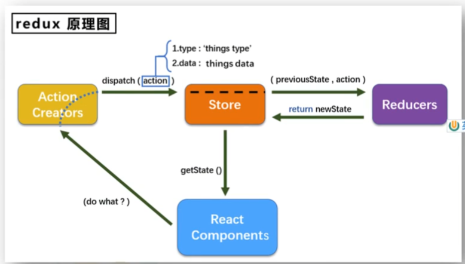
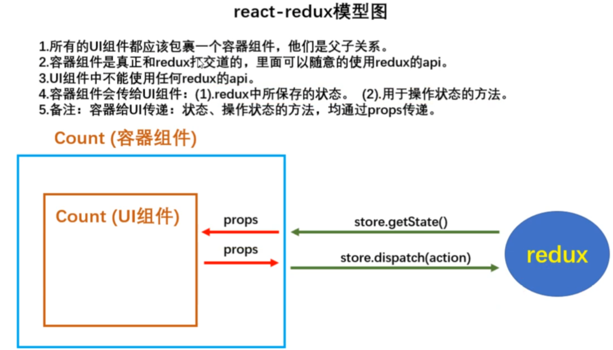
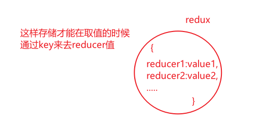
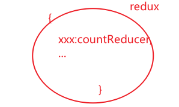

redux是一个专门用于做**状态管理**的JS库(**不是react插件库**)

> 作用:**集中式**管理react应用中**多个组件共享的状态**

> 原则:**能不使用就不用**,如果不用的话**比较吃力才考虑使用**

## redux原理图



> React Components:创建状态 如:+1
>
> Action Creators:包装状态 把React Components创建的**包装为action对象**,**action就是object类型的**,然后交给store
>
> Store:把得到的action给Reducers,Reduces才是真正处理的
>
> Reducers:接收到previousState(之前的值),action(包装好的),然后返回一个**新的**状态给store
>
> ​		Reducers干**两件事**
>
> 		1. 初始化状态,如果是初始化状态,previousState就是undefined
> 		2. 加工状态
>
> 最后等到要用的时候React Components直接向store取状态就用**getState()**

#### action

> 1. 动作的对象
> 2. 包含两个属性
>    1. type:标识属性,**值为字符串**,**唯一**,必要属性
>    2. data:数据属性,值**类型任意**,可选实现
> 3. 例子
>    1. {type:'Add',data:1}

#### reducer

> 1. 用于初始化状态,加工状态
> 2. 加工时,根据旧的state和action,产生新的state的**纯函数**

#### store

> 1. 将state,action,reducer**联系到一起**的对象
> 2. 如何得到**此对象**
>    1. import {createStore} from 'redux'
>    2. import reducer from './reducers'
>    3. const store = createStore(reducer)
> 3. 此对象的功能
>    1. getState():得到state
>    2. dispatch(action):分发action,触发reducer调用,产生新的state
>    3. subscribe(listener):**注册监听**,当产生新的state时,自动调用

## 实现

> 在项目文件src新建文件夹redux用于存放
>
> 在redux新建store.js
>
> 在redux新建一个reducer文件，并且这个文件是只处理一个文件的state
>
> 在redux新建一个action.js文件

```react
store.js
// 该文件专门用于暴露一个store对象，整个应用只有一个store对象

// 引入createStore，用于创建redux最和新的store对象
import { createStore } from 'redux'
// 引入为count组件服务的reducer  这里的文件是自己写的那个
import countReducer from './reducer'

export default createStore(countReducer)
```

```react
reducer.js
//该文件用于创建一个为conunt服务 reducer，reducer本质就是一个函数
//reducer是纯函数
//需要暴露，store才能取到
export default function (previousState,action) {
  	const {type,data} = action
    //内部逻辑
}
```

> react components

```react
import React, { Component } from 'react';
import store from 'store路径'
class App extends Component {
  render() {
    return (
      <div>
        <容器组件 store={store}/> //传递
      </div>
    );
  }
}

export default App;
```

> action

```react
action.js
//这是分别暴露
exprot const xxxAction = data => {
	return {type:'xxx',data} //属性重名简写data
}
```


> 传递 dispatch

```react
store.dispatch(xxxAciton(xxx))
```

> 监测store更新,因为redux并**不会因为状态发生变化而自动更新视图**,所以需要手动监测状态,然后更新

```react
componentDidMount(){
	store.subscribe(()=>{
    	this.setState({})//尽管这里什么也没用改变,只要调了setState也会触发render
    })
}
```

> **注意:自己手动调render()并没有用,只有通过调setState才会引起render的更新**

## 小技巧

> `componentDidMount(){
> 	store.subscribe(()=>{
>     	this.setState({})//尽管这里什么也没用改变,只要调了setState也会触发render
>     })
> }`
>
> 这堆代码需要在每个组件内使用,如果我没有20个组件,那么需要写20次
>
> 我们可以直接在index.js内只写一次

```react
import React from "react";
import ReactDOM from "react-dom";
import { BrowserRouter } from "react-router-dom";
import App from './App'
import store from 'store的路径'

ReactDOM.render(<App />,document.getElementById("root"));

//只要状态发生变化那么我们就直接更新整个app,这里不会出现效率低下的问题,因为有diffing算法
store.dispatch(()=>{
	ReactDOM.render(<App />,document.getElementById("root"));
})
```

## 在公司中开发

> 在公司中开发 redux文件下还会多一个文件 canstant.js(定义常量)

```react
//该模块是用于定义action对象中type类型的常量值,目的只有一个,便于管理的同时防止程序员写错
export const INCREMENT = 'increment'
...increment
//在用到increment的地方引入使用INCREMENT即可
```

##  高级

#### 异步action

> aciton**不仅仅**可以是object类型
>
> * object{}  **同步action**
> * function {}  **异步action**  不是必须

```react
action.js
export const createAsyncAction = (data,time) => {
    //这里必须返回一个函数,因为只有函数才能启动异步任务
	return () => {
    	.....
    }
}
```

> **注意:如果是上面这样写也是不行的,缺少中间件**

> 需要下载中间件
>
> `npm install redux-thunk`
>
> **如果不使用中间件,store是不收函数类型的action**

> 在store.js文件使用

```react
import {createStore,applyMiddleware} from 'redux' //需要从redux引入这个
import thunk from 'redux-thunk'
export default createStore(xxReducer,applyMiddleware(thunk))
```

## react-redux

> react-redux是facebook出品的
>
> `npm install react-redux `



> UI组件都是放在**compoents文件夹下**
>
> 容器组件放在**containers文件夹下**

```react
//容器组件
引入UI组件
import UI组件 from 'compoents下的UI组件'
//这里不用引入store
引入connect用于连接UI组件与store
import {connect} from 'react-redux'
//创建并暴露一个容器组件
export default connect()(UI组件) //connect是一个函数,返回的值也是一个函数
```

> 在App.jsx下渲染的时候,就应该渲染容器组件了,因为容器组件已经把UI组件包裹了

```react
import React, { Component } from 'react';
import store from 'store路径'
import xxx from './containers/xxx'
class App extends Component {
  render() {
    return (
      <div>
        <xxx store={store}/> //渲染容器组件,并且传递store
      </div>
    );
  }
}

export default App;
```

#### connect()

> 接收两个参数,并且这**两个参数是函数**
>
> **返回值为函数**,返回的这个函数的参数为**需要包裹的UI组件**
>
> 接收的**第一个**参数的**返回值**是作为状态传递给UI组件

```react
//a函数返回的对象中的key作为传递给UI组件props中的key,value就是是UI组件props的value
a =() => {
	return {num:1} //这里必须返回对象
}
//b函数返回的是对象,对象中的key是props的key,value就是props中的value,但是对象里面存放的是方法
b= () => {
	return {xx:()=>{console.log('1');}}
}
export default connect(a,b)(UI组件)
```

#### 容器组件获取redux状态

```react
//这里得到redux中的状态直接就在参数写state,因为在App中已经传递了store,并且自动把状态传过去了
a =(state) => {
	return {num:state} 
}
b= () => {
	return {xx:()=>{console.log('1');}}
}
export default connect(a,b)(UI组件)
```

#### 通知redux执行操作

```react
import {xxxAction} from 'action路径'
a =(state) => {
	return {num:state} 
}
//这里的dispatch也是redux自动传递过了,我们只是用dispatch来接收一下
b= (dispatch) => {
	return {xx:(params)=>{
        dispatch(xxxAction{params})
    	}
    }
}
export default connect(a,b)(UI组件)
```

#### 规范connect()参数名

> 官方:

```react
import {xxxAction} from 'action路径'
mapStateToProps =(state) => {
	return {num:state} 
}
mapDispatchToProps = (dispatch) => {
	return {xx:(params)=>{
        dispatch(xxxAction{params})
    	}
    }
}
export default connect(mapStateToProps,mapDispatchToProps)(UI组件)
```

#### 优化

##### 优化mapDispatchToProps

> 在connect中的mapDispatchToProps函数**可以不写dispatch**,因为react-rudex**会自动帮我调dispatch:**

```react
export default connect(
    mapStateToPropsmapStateToProps,
    //mapStateToPropsmapStateToProps的简写
    {
    	xxx:xxxAction,//只要这里传了action函数,那么可以不写dispatch,react-rudex会自动调
    }
)(UI组件)
```

##### 取消监测

> 使用了react-rudex就可以不用再检测redux的状态变化了,因为react-rudex已经帮我们监测了.
>
> **实现:因为我们使用了connect()**

```react
//index.js
import React from "react";
import ReactDOM from "react-dom";
import App from './App'

ReactDOM.render(<App />,document.getElementById("root"));

//注意看这里
//store.dispatch(()=>{
	//ReactDOM.render(<App />,document.getElementById("root"));
//})
```

##### 优化传递store

> 在容器组件中我们需要使用到store,但是是通过在app中传输属性store,传递的

> 优化:

```react
import React, { Component } from 'react';
import store from 'store路径'
class App extends Component {
  render() {
    return (
      <div>
        <容器组件/> //不用在这传递store
      </div>
    );
  }
}

export default App;
```

> Provider:App内**所有**容器组件都能收到store

```react
//index.js
import React from "react";
import ReactDOM from "react-dom";
import App from './App'
import store from 'store路径'
// 使用Provider
import {Provider} from 'react-rudex'
ReactDOM.render(
    <Provider>
        <App store={store}/>
    </Provider>,
    document.getElementById("root")
);
```

##### 整合UI组件和容器组件

> 文件层面优化

> 把容器组件和UI组件**写在一个文件内**

#### 合并reducers

> 在实际开发中,会出现多个reducer的情况,我们需要合并reducer,redux才能正常工作

> 在只有一个reducer的情况下,redux内只会存一个reduer,但是在多个reducer的情况下,redux内就会以对象的形式存储reducer



> `combineReducers`
>
> combineReducers调用**时传入的对象**,就是redux帮我们**保存的总的状态对象**

```react
import { createStore,combineReducers } from 'redux'
import countReducer from './reducer'

//汇总reducer
const allReducer = combineReducers({
    xxx:countReducer,
    ...
})
                        //这里传入的就是汇总的reducer
export default createStore(allReducer)
//export default createStore(countReducer)
```



> 当然在cnnect()中取的时候也应该是用`.`取

````react
import {xxxAction} from 'action路径'
	//state就是redux的状态,想这样取,那么就取到了一个对象,是错误的,需要.key取对象的value
mapStateToProps =(state) => {
	return {num:state.xxx} 
}
mapDispatchToProps = (dispatch) => {
	return {xx:(params)=>{
        dispatch(xxxAction{params})
    	}
    }
}
export default connect(mapStateToProps,mapDispatchToProps)(UI组件)
````

#### 纯函数

> 在react-redux底层其实做了**判断**,如果返回的数据状态是之前的状态,那么页面不会更新的
>
> **这时我们在操作reducer时如果操作数据的内存地址没有发生变化,那么页面是不会更新的**

```js
let arr =[1,2,3]
arr.push(4)
//这里的arr的地址并不会变化,所以我们需要用新的变量来存储返回
```

> **纯函数:**

```js
//只要有**同样**的输入(实参),必定得到**同样**的输出(返回)
//不是纯函数,因为每次调用同样的参数,返回不是同样的
function(a){
    return math()+a
}
```

```js
//不得改写参数数据
//这就不是纯函数了,因为a被改写了
function (a) {
	a=9 
}
```

```js
//不会产生,比如网络请求,输入和输出设备
```

```js
//不能调用Date.now()或者Math.random()等不纯的方法
```

```js
//redux的reducer必须是一个纯函数
```

