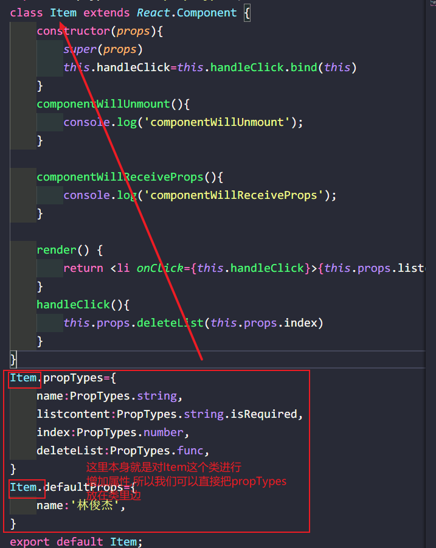

> 属性校验主要是为了在之后业务量庞大的时候,起到确保数据类型不变化,不会出现业务逻辑错误

> 父组件向子组件**传递属性**,就**需要**使用属性校验

> 在子组件中引入PropTypes
>
> 因为是父组件向子组件传递属性,所有是子组件属性校验

```react
import React, { Component } from 'react';
import PropTypes from 'prop-types'; //引入
class Item extends React.Component {
    constructor(props){
        super(props)
        this.handleClick=this.handleClick.bind(this)
    }
    render() { 
        return <div onClick={this.handleClick}>{this.props.listcontent}</div>;
    }
    handleClick(){
        this.props.deleteList(this.props.index)
    }
} //注意这个位置
//注意这里实在Item这个类的外面的
Item.propTypes={ //propTypes 写死
    listcontent:PropTypes.string, //父组件传递的属性进行校验
    index:PropTypes.number,
    deleteList:PropTypes.func, //验证函数 func
}
export default Item;
```

> isRequired 
>
> 必须传递,如果没传递就报错

```react
Item.propTypes={
    listcontent:PropTypes.string.isRequired, //先进行是否传递校验再进行是否为字符串校验
    index:PropTypes.number,
    deleteList:PropTypes.func,
}
```

> 子组件名.defaultProps
>
> 默认属性值

```react
Item.propTypes={
    name:PropTypes.string,
    listcontent:PropTypes.string.isRequired,
    index:PropTypes.number,
    deleteList:PropTypes.func,
}
Item.defaultProps={
    name:'林俊杰', //默认传递
}
```

> 更多属性校验https://zh-hans.reactjs.org/docs/typechecking-with-proptypes.html

#### 简写



```react
import React, { Component } from 'react';
import PropTypes from 'prop-types';
class Item extends React.Component {
    //这里就需要static 表示类的静态属性
    static propTypes={
        name:PropTypes.string,
        listcontent:PropTypes.string.isRequired,
        index:PropTypes.number,
        deleteList:PropTypes.func,
    }
	//这里就需要static 表示类的静态属性
    static defaultProps={
        name:'林俊杰',
    }
    constructor(props){
        super(props)
        this.handleClick=this.handleClick.bind(this)
    }
    componentWillUnmount(){
        console.log('componentWillUnmount');
    }

    componentWillReceiveProps(){
        console.log('componentWillReceiveProps');
    }

    render() { 
        return <li onClick={this.handleClick}>{this.props.listcontent}</li>;
    }
    handleClick(){
        this.props.deleteList(this.props.index)
    }
}
export default Item;
```

> **记住需要使用static**


