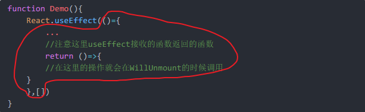
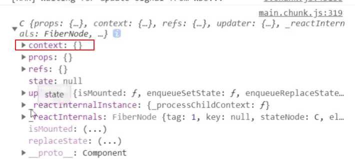
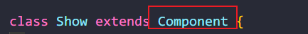

## setState

> setState两种写法

> 1. setState(stateChange. [callback]) --**对象式**的setState
>
>    1. stateChange为**状态改变对象**(该对象可以**提现出状态的改变**)
>
>       如:setState({count:1})
>
>    2. callback是**可选**的回调函数,它在**状态更新完毕,**界面也**更新后**(render调用后)才被调用

> **官网:React的页面更新时异步的**

```react
this.setState({count:1}) //这里的setState是同步的,但是后续的方法时异步的
//setState后面马上输出count值会发生还是1,就是因为后续是异步的,才导致页面更新了,值还没有更新
```

> 所以这个callback就是解决值更新的问题

```react
this.setState({count:1},()=>{
    xxx //这里的内容会在count执行和render执行之后马上被调用,所以说值就是准确的了
})
```

> 2. setState(updater, [callback]) --**函数式**的setState
>    1. updater为返回stateChange**对象的函数**
>    2. updater可以**接收到state和props**
>    3. callback是**可选**的回调函数,**它在状态更新,界面也更新后(render调用后)才被调用**

```react
this.setState(()=>{
    return {count:1} //这里第一个参数就是updater,然后updater返回一个对象
})
//并且可以接到state,props
app.jsx
...
	<count x={1 }/> //这里传的x
...
count.jsx

state = {count:0}
           //这个state就是上面定义的的state ,props就是传递的props
this.setState((state,props)=>{
    return {count:state.count+1}
})
```

> 总结:对象式的setState是函数式的setState的**语法糖**
>
> 1. 使用原则(没有那么绝对,知道即可)
>    1. 如果新状态**不依赖**于原状态 => 使用对象方式 **如:想要直接改变值**
>    2. 如果新状态**依赖**于原状态 => 使用函数方式 **如:想要自增**
>    3. 如果需要在**改完之后**看到状态,**必须在回调里面拿**,否则**不是**最新的值

## lazyLoad

> 懒加载
>
> 一般都是路由的懒加载,只有当用户点击了路由才加载相应路由(现点现加载)

```react
import React,{Component,lazy} from 'react'
const Home = lazy(()=>{import('./Home')})
const About = lazy(()=>{import('./About')})
//但是这样会出现一中情况
```

> 如果用户的**网速很慢,请求的资源迟迟没有回来,**那么**页面就会白屏**,这里react就给我准备了一个内置的**Suspense**

```react
import React,{Component,lazy,Suspense} from 'react'
const Home = lazy(()=>{import('./Home')})
const About = lazy(()=>{import('./About')})
//在注册路由的地方
<Suspense fallback={这里可以写一个组件,用于显示资源回来的时候的显示}>
	<Route .../>
</Suspense>
```

## Hooks

> 1. Hook是React 16.8.0版本增加的**新特性/新语法**
> 2. 可以让你**在函数组件中使用 state 以及其他的 React 特性**

#### 三个常用Hook

> * State Hook: React.useState()  //这个能让函数式组件也能用state
> * Effect Hook: React.useEffect()
> * Ref Hook: React.useRef()

##### React.useState()

```react
function Demo(){
    //这个里面只包含两个东西,是个数组
    //1.状态 2.更新状态的方法
    const [a,b] = React.useState(0)
    console.log(a,b)//输出:0 一堆函数
    
    function add(){
        b(a+1)
    }
    
    return(
        <div>
            <p>{a}</p>
            <button onClick={add}>加</button>
        </div>
    )
}
```

> 这个Demo()函数的**调用次数**也是**和类式组件一样是1+n次**
>
> 但是`const [a,b] = React.useState(0)`这行代码**不会被多次执行**,这里react底层已经处理了

> setXxx()2种写法:
>
> 1. setXxx(newValue): 参数为**非函数值**, 直接指定新的状态值, 内部用其覆盖原来的状态值
> 2. setXxx(value => newValue): 参数**为函数**, 接收原本的状态值, 返回**新的**状态值, 内部用其**覆盖原来的状态值**

```react
//多个state
function Demo(){
    const [a,b] = React.useState(0)
    const [c,d] = React.useState('张三')
    ...
    
    return(
        <div>
        </div>
    )
}
```

##### Effect Hook

> 可以让你在**函数组件**中执行副作用操作(用于**模拟类组件中的声明周期钩子**)
>
> 并且**接收**的参数是函数,函数体内**在组件卸载前执行**

```react
function Demo(){
    const [count,num] = React.useState(0)
    
    React.useEffect(()={
        ...
    },这里可以有一个参数,如果不写那么就全都监测,可以写[]表示谁也不监测)
}
```

> 如果需要监测几个,**而不是全部**

```react
function Demo(){
    const [count,num] = React.useState(0)
    
    React.useEffect(()={
        ...
    },[count]) //只监测count,只要count发生变化,那么就执行函数体内内容
}
```

> 注意:在useEffect内如果想使用WillUnmount()的功能,那么就需要在useEffect**接收**的函数的**返回**的那个**函数相当于WillUnmount()**

```react
function Demo(){
    React.useEffect(()={
        ...
        //注意这里useEffect接收的函数返回的函数
        return ()=>{
        //在这里的操作就会在WillUnmount的时候调用
    }
    },[])
}
```



> 总结:
>
> useEffect Hook可以**看做3个钩子函数的组合**
>
> 1. component**Did**Mount()
> 2. component**DidUpdate**()
> 3. component**WillUnmount**()

##### Ref Hook

> 在函数组件中使用ref
>
> 作用:**保存标签对象**,功能与**React.createRef()一样**

```react
function Demo(){
    const myRef = React.useRef()
    
    function show(){
        console.log(myRef.current.value)
    }
    
    return(
    	<div ref={myRef}>123</div>
   )
}
```

## Fragment

> 可以不用必须有一个真实的DOM根标签了
>
> 在不想要最外层的div的时候就可以使用

```react
import React, { Component,Fragment } from 'react';

class Show extends Component {
  render() {
    return (
      <Fragment>
            <div></div>
            <div></div>
            ...
      </Fragment>
    );
  }
}

export default Show;
```

> 还有一个更加有趣的做法(**不推荐使用**)

```react
import React, { Component } from 'react';

class Show extends Component {
  render() {
    return (
        //可以写空标签,不会被渲染
      <>
            <div></div>
            <div></div>
            ...
      </>
    );
  }
}

export default Show;
```

> 区别在于fragment是**可以写**属性的,但是**只能写一个**,**必须是key**
>
> 而空标签**什么都不能写**

## Context

> 一种组件间通信方式,常用于`祖组件`与`后代组件`间通信

```react
import React, { Component } from 'react';

class C extends Component {
  render() {
      console.log(this) //这里输出的内容就是下面的图片
    return (
      <div>
      </div>
    );
  }
}

export default C;
```



#### 使用方法1(只能类组件使用)

```react
import React, { Component } from 'react';
import Child from './Child';

const MyContext = React.createContext() //创建Context对象
//然后从MyContext身上解构出provider
const {Provider} = MyContext

class Preson extends Component {
  render() {
    return (
      <div>
            //这里需要使用Provider包裹需要传递参数的子孙组件
            <Provider value={'需要传递的数据'}>
            	<Child/>
            </Provider>
      </div>
    );
  }
}

export default Preson;
```

```react
import React, { Component } from 'react';

class Child extends Component {
  
  static contextType = MyContext //只有声明接收,这个的组件才能拿到祖组件传递的数据
    
  render() {
      console.log(this) //这里的this就能接收到祖组件传递value
    return (
      <div>
      </div>
    );
  }
}

export default Child;
```

#### 使用方法2(函数类组件都能用)

> 从context对象上取**Consumer**(使用者)

```react
import React, { Component } from 'react';
import Child from './Child';

const MyContext = React.createContext() //创建Context对象
//取Consumer
const {Provider,Consumer} = MyContext

class Preson extends Component {
  render() {
    return (
      <div>
            //这里需要使用Provider包裹需要传递参数的子孙组件
            <Provider value={'需要传递的数据'}>
            	<Child/>
            </Provider>
      </div>
    );
  }
}

export default Preson;
```

```jsx
function C(){
    return(
    <div>
    	<Consumer>
            {
                value => {
                    return <span>{value.xxx}</span>
                }
            }
        </Consumer>    
    </div>
    )
}
```

## **组件优化**

##### component的两个问题

> 1. 只要执行setState()**,即使不改变**状态数据,组件**也会重新render()** =>效率低
> 2. 只要当前组件**重新render()**,就会**自动重新render子组件**,即便子组件**没有用到**父组件的**任何数据** => 效率低



##### 效率高的做法

>  只有当组件的state或者props数据发生变化时才重新render()

##### 原因

> component中的shouldComponentUpdate()总是返回true

##### 解决

```react
首先解决问题1
问题1就出在setState的身上
我们需要使用shouldComponentUpdate()来解决
import React, { Component } from 'react';

class Preson extends Component {
    
  state = {name:'张三'}
    
  changeName=()=>{
      this.setState({name:'李四'})
  }
    
  //接收两个参数,都会下一个将改变的值
  shouldComponentUpdate(nextProps,nextState){
      //这里我们就可以判断,如果nextState和现在state内的值一样我们就可以return false,不让更新,现在这样调用setState({})就晃不到了
      if(this.state.name === nextState) return false
      else return true
  }
  
  render() {
    return (
      <div>
            <p>当前:{this.state.name}</p>
            <button onClick={this.changeName}>改名</button>
      </div>
    );
  }
}

export default Preson;
```

```jsx
解决第二个问题
第二个问题,就是也可以使用shuldComponentUpdate来解决
下面是子组件
import React, { Component } from 'react';

class Child extends Component {
    
  shouldComponentUpdate(nextProps,nextState){
      //判断是否传递props,如果没有传递props,那么就不更新
      //如果传递props了,判断是否props发生变化
      if(this.props.xxx === nextProps.xxx) return false
      else return true
  }
    
  render() {
    return (
      <div>
           Child...
      </div>
    );
  }
}

export default Child;
```

##### **重点**

> 当然在实际开发中,我们**并不自己写**这么多来控制这个shouldComponentUpdate的开关,**而是使用PureComponent**
>
> **PureComponent**:重写阀门逻辑

```react
import React, { Component,PureComponent } from 'react';
				//继承PureComponent
class xxx extends PureComponent {
    
  render() {
    return (
      <div>
           xxx...
      </div>
    );
  }
}

export default xxx;
```

**值得注意的是**

> PureComponent在**底层是做的浅比较**,如果**state还是原来的state**,那么PureComponent**就会返回false**
>
> 什么时候会出现这种情况呢:

```react
import React, { Component,PureComponent } from 'react';
				//继承PureComponent
class xxx extends PureComponent {
    
  state = {name:'李四'}
    
  //这样一波操作下来,setState里面的地址没有任何改变,所以PureComponent会返回false导致不会刷新,但是这样的setState操作方法是没有错的
//所以尽量别这么给setState操作
  xxx = () => {
      const obj = this.state
      obj.name = '张三'
      this.setState(obj)
  }
    
  render() {
    return (
      <div>
           xxx...
      </div>
    );
  }
}
export default xxx;
```

> **总结:不要使用原来的数据,要返回新数据**

## renderProps

> 

