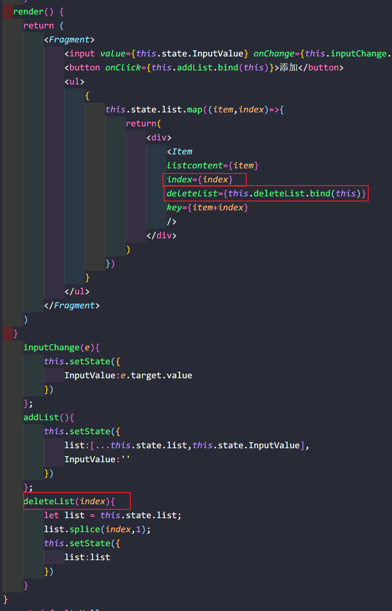
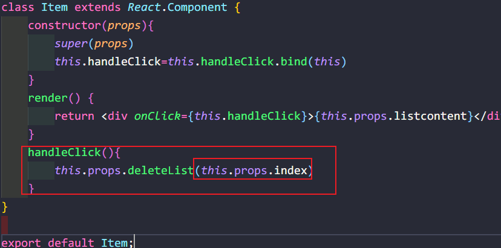

##  props方式

#### 传参

> 父组件

```react
return(
    <div>
        # 这里的listcontent是自定义的属于名 item循环的数据
        <Item listcontent={item} />
    </div>
)
```

> 子组件

```react
 render() { 
     #需要使用this.props 然后这里的listcontent为父组件传递过来的props
        return <div>{this.props.listcontent}</div>;
    }
```

#### 传递事件

> 父组件



> 子组件



## 子传父

> props

> 子组件调用父组件函数,携带函数参数

```react
//父组件
do =(data) =>{
    console.log(data)
}
<Child do={this.do} />
```

```react
//子组件
//这里必须使用箭头函数,this指向才没有问题
done = () => {
	this.props.do('传递')
}
```

