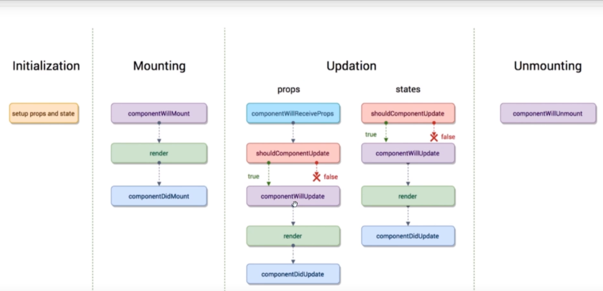
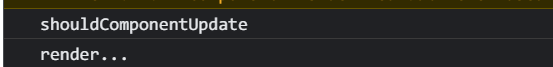
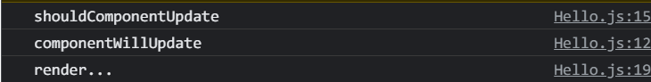
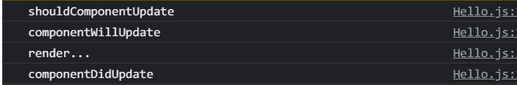
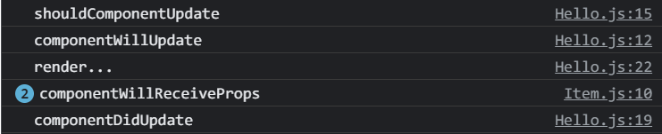

> 用一句最简单的话来解释生命周期
>
> **在某一时刻,可以自动执行的函数**

> Initializtion (组件初始化阶段)
>
> Mounting(组件挂载阶段)
>
> Updation(发生更新时)



## Updation

#### shouldComponentUpdate

> 这个函数是在**组件更新之前**被自动执行
>
> shouldComponentUpdate是**在render之前被执行**

```react
shouldComponentUpdate(){
      console.log('shouldComponentUpdate');
      return true //这里必须返回Boolean值,返回false表示不执行,返回true表示继续执行
  }
```



#### componentWillUpdate(**已废弃**)

> 这个生命周期函数是在**shouldComponentUpdate之后**被执行,并且在**render之前**



> 该函数在最新版本React中已经被取消

#### render

> render函数是必须要写,其他生命周期函数可以不写**,render必须写**

#### componentDidUpdate

> 组件更新渲染完毕,生成虚拟dom之后自动执行
>
> 它是在render之后执行

```react
componentDidUpdate(){
      console.log('componentDidUpdate');
  }
```



#### componentWillReceiveProps(**已废弃**)

> 这个函数之后在组件接收到参数之后才会执行
>
> **如果使用的顶层组件,即代表没有父组件的组件中使用,那么是不会被触发的**
>
> **触发条件:**
> 组件**第一次存在于dom中**,函数**不会**被执行
>
> 如果**已经存在于dom中**,函数**才会**被执行

```react
//子组件
componentWillReceiveProps(){
        console.log('componentWillReceiveProps');
    }
```



## Unmounting

#### componentWillUnmount

> 当组件**将要**被卸载时自动执行

## **17.x**

> 如果想在18的版本中使用这三个钩子,就**必须加unsafe前缀**,因为这三个钩子可能会在react**未来版本被废弃.**并且unsafe不是不安全的意思**,因为在未来版本中可能会触发一些bug**
>
> componentWillReceiveProps => **UNSAFE_**componentWillReceiveProps
>
> componentWillUpdate => **UNSAFE_**componentWillUpdate
>
> componentWillMount => **UNSAFE_**componentWillMount 
>
> 官网解释:https://react.docschina.org/docs/react-component.html

## 新增

> static getDerivedStateFromProps(props, state)
>
> getSnapshotBeforeUpdate(prevProps, prevState)

> componentDidMount('**这里可以拿到getSnapshotBeforeUpdate的返回值**')

## **重要的钩子**(经常使用)

> 1. render:初始化渲染或更新渲染调用
> 2. componentDidMount:开启监听,发送ajax请求
> 3. componetWillUnmount:做一些收尾工作
