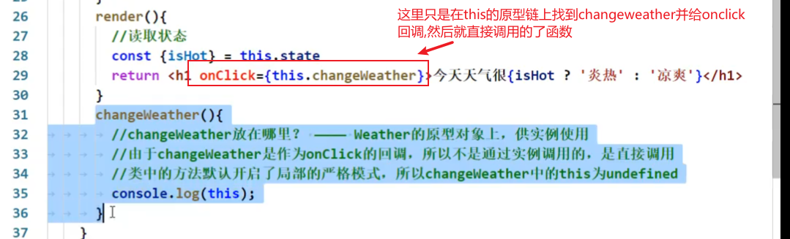

> 普通绑定this

```react
 <input value={this.state.InputValue} onChange={this.inputChange.bind(this)}/>
```

> 这种绑定this的方法不易性能优化

> 构造函数内绑定this **(更好)**

```react
class Item extends React.Component {
    constructor(props){
        super(props)
        this.handleClick=this.handleClick.bind(this) //在原型链上找handleclick之后,绑定this.再赋值给一个新的函数hanldeclick,所有onclick触发的函数不是,原型链上的handleclick了,而是Item自身的handleclick
    }
    render() { 
        return <div onClick={this.handleClick}>{this.props.listcontent}</div>;
    }
    handleClick(){

    }
}
```

#### **为什么需要绑定this**



#### 真正实际发开时绑定this

> **使用箭头函数**

```react
class Item extends React.Component {
    }
    render() { 
        return <div onClick={this.handleClick}>{this.props.listcontent}					</div>;
    }
    handleClick =()=>{  //使用箭头函数,就不需要再绑定this了,因为箭头函数自身没有this,会找外层的this

    }
}
```

