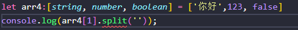

####  布尔

> 基础类型
>
> let 变量名: 数据类型 = 值

```ts
let flag:boolean = true
```

#### 数字

> Ts和Js一样里面**所有数字**都是**浮点数**

> **ts中变量一开始是什么类型,之后的赋值必须是这个类型的数据**

#### underfined和null

```ts
let und: undefined = undefined
let nll: null = null
```

> undefined和null都**可以作为其他类型的子类型**,把undefined和null**赋值给其他类型的变量**

```ts
let num: number = undefined
```

#### 数组

> 数组定义方式1
>
> let 变量名: number[] = [值]

```ts
let arr:number[] = [1,2,3,4]
```

> 数组定义方式2:**泛型写法**
>
> let 变量名:Array<number> = [值]

```tsx
let arr2: Array<number> = [100,200,300]
```

> 以上是**数字数组**传入的值都**必须是number类型**

##### 元组类型数组

> **注意:严格模式下需要值得顺序必须和定义时的顺序一致**
>
> **个数也得一致**

```ts
let arr3:[string, number, boolean] = ['你好',123, false]
```

##### **注意**



> **当调用arr下标为1的值时,因为在定义时第二个值是数字类型所以没有split方法会报错,总结:相应的值调用相应的方法**

#### 枚举

> 枚举里面的**每个数据值都可以叫元素**,每个元素都**有自己的编号**,编号是**从0开始**的,依次的递增加1

```ts
enum Color{
  red,
  green,
  blue
}
// 定义一个Color的枚举类型的变量来接收枚举的值
let color: Color = Color.red
console.log(color);
//输出 0
console.log(Color.red,Color.green,Color.blue);
//输出 0 1 2
```

> 也可以通过**下标获取到值**

```ts
console.log(Color[2]);
//输出 blue
```

#### any

> any可以**存储任何类型**的值

```ts
let an: any = '你好'
let an: any = 111
//都是可以的
```

> 当一个数组中要存储多个数据,个数不确定,类型不确定就可以使用any

```ts
let arr: any[] = [100,'你好',true]
console.log(arr)
```

##### **注意**

> 当使用any的时候

```ts
let arr: any[] = [100,'你好',true]
console.log(arr[0].split())
```

> **这种情况命名第一个值是数字时调用其他类型的方法就会导致报错**

#### unknown

> 因为类型为any的变量赋值给其他类型的变量时会导致其他类型的变量变为any
>
> unknown就不会，unknown也是在不知道变量类型的情况下使用，但是unknown并不会导致被复制变量变为unknown

#### void

> 它**没有任何类型**,**当一个函数返回值时**,你通常会见到其返回值类型是void

```ts
const showMsg = ():void =>{
  console.log(11);
}
console.log(showMsg());
//输出 undefined
```

#### never

> 表示函数永远不会返回结果，void返回空，其实在某种意义上也返回空也是一种返回值，never就是真的没有，连空都没有

> 用于报错的函数就是可以设为never

#### object

> `object`表示非原始类型,也就是除`number`,`string`,`boolean`之外的类型

```ts
const getObj=(obj: object): object=>{
  console.log(obj);
  return {
    name:'李云龙',
    age:12
  }
}
console.log(getObj({
  name:'赵刚',
  age:13
}));
```

##### 可选属性

> ?

```tsx
                    //age属性表示可选，有没有都可以
let b : {name:string,age?:number}
b = {name:jack} //正确
b = {name:jack,age:10} //正确

                    //表示任意类型的属性，表示可以有任意属性
let c : {name:string,[propName:string]:any}
c = {name:'jack',age:10,sex:'mela'}
```

#### Array

> 变量:类型[]
>
> Or 
>
> 变量:Array<类型>

```ts
let b : string[];
b = ['a','b','c']

let c : Array<number>;
c = [1,2,3]
```


#### 类型断言

> 当使用联合类型时,进行**判断传入的值是什么类型的操作**,但是当前函数并还**没有接收**到参数,**无法**进行检测,就会出现**编译阶段报错**,**此时就可以使用类型断言**

> 语法1:<类型>变量名
>
> 语法2:值 as 类型

```ts
function getString(str:string|number):number{
  if((<string>str).length)
  {
    return (<string>str).length;
  }
  else{
    return str.toString().length;
  }
}
```

```ts
return (str as string).length;
```

> **类型断言需要使用圆括号包裹尖括号里面是断言的类型外面是传入的变量**
>
> `(<string>str)`

#### 类型推断

> 在没有明确的指定类型的时候推测出一个类型

```ts
let x = 123 //number
x = '你好' //报错

let y; //any 推断出来的any类型
y =123
y = '你好'
```


#### **返回值类型**

> 可以指定输入进来的值得类型,也可以控制函数输出出去的类型

箭头函数形式

```ts
const test=(str: string): string=>{
  return str
}
//返回出来的类型也将是string类型
```

函数形式

```ts
function test(msg:string):string{
  return msg
}
```

#### 类型别名

> Type 变量 = 类型;

```typescript
type myType = 1 | 2 | 3 | 4 | 5;

let m : myType;

m = 1
m = 6 //错误
```


