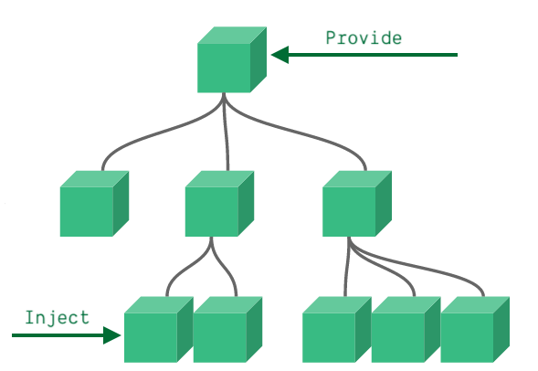
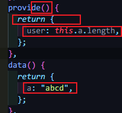
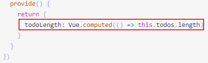

#### Provide / Inject基本使用

> Provide / Inject的作用就是在组件之间层级非常多的情况下，从祖先组件传给一个指定组件数据，不需要通过中间的组件进行重复传递
>
> **父组件有一个 `provide` 选项来提供数据，子组件有一个 `inject` 选项来开始使用这些数据**



> 下面是把数据从home.vue传递给A.vue的子组件

```vue
<template>
  <div class="home">
    <A></A>
  </div>
</template>

<script>
import A from "@/components/A.vue";
export default {
  name: "Home",
  components: {
    A,
  },
  provide: {
    user: "John Doe", //传送值
  },
};
</script>
```

```vue
<template>
  <div>
    <B></B>
  </div>
</template>
<script>
import B from "@/components/B.vue";
export default {
  name: "A",
  components: {
    B,
  },
};
</script>
```

```vue
<template>
  <div>{{ this.user }}</div> //使用值
</template>
<script>
export default {
  name: "B",
  data() {
    return {};
  },
  inject: ["user"], //最终这里接收到home传递值并使用
};
</script>
```

> Provide / Inject是成对出现，不需要定义在data()里面

#### 访问组件实例property

> 如果需要访问组件实例property不能直接传递，**需要把provide转换为返回对象的函数**



这样才能传递成功

```vue
<template>
  <div class="home">
    <A></A>
  </div>
</template>

<script>
import A from "@/components/A.vue";
export default {
  name: "Home",
  components: {
    A,
  },
    // 重点是把provide转换为返回函数
  provide() {               //
    return {                //
      user: this.a.length,  //
    };                      //
  },                        //
    // 重点是把provide转换为返回函数
  data() {
    return {
      a: "abcd",
    };
  },
};
</script>

```

```vue
<template>
  <div>
    <B></B>
  </div>
</template>
<script>
import B from "@/components/B.vue";
export default {
  name: "A",
  components: {
    B,
  },
};
</script>
```

```vue
<template>
  <div>{{ this.user }}</div>
</template>
<script>
export default {
  name: "B",
  data() {
    return {};
  },
  inject: ["user"],  成功接收到组件实例property
};
</script>
```

> 这使我们能够更安全地继续开发该组件，而不必担心可能会更改/删除子组件所依赖的某些内容。这些组件之间的接口仍然是明确定义的，就像 prop 一样。
>
> - **父组件不需要知道哪些子组件使用它 provide 的 property**
> - **子组件不需要知道 inject 的 property 来自哪里**

#### **处理响应性**

> **如果祖先组件传递的数据发生变化，从而对子孙组件上的inject做成响应**，就需要为provide锁传递的数据或property分配一个组合式API **computed**



> 在这种情况下，任何对 `todos.length` 的改变都会被正确地反映在注入 `todoLength` 的组件中

