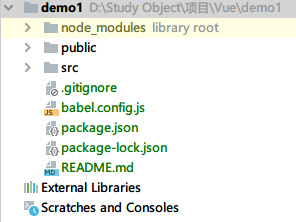
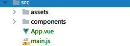

**这是Vue cli 3.x版本的项目结构**

* node_modules:项目所有依赖的包文件
* public:本地服务的文件夹
* src:工作目录
* .gitognore:不需要上传到仓库中的文件的配置
* babel.config.js:有关babel的配置
* package.json:项目基本配置说明
* README.md:说明文件

favicon.ico:网页图标

index.html:主页

assets:放入资源（图片，css）

components:放入组件

App.vue:根组件

main.js:项目的全局配置

