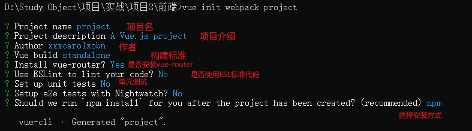
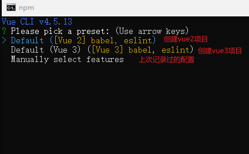
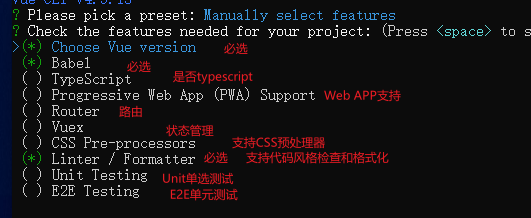
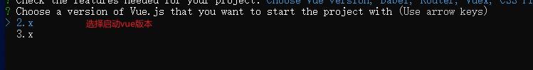
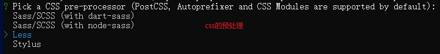
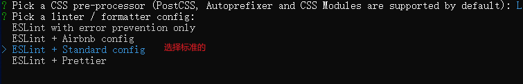
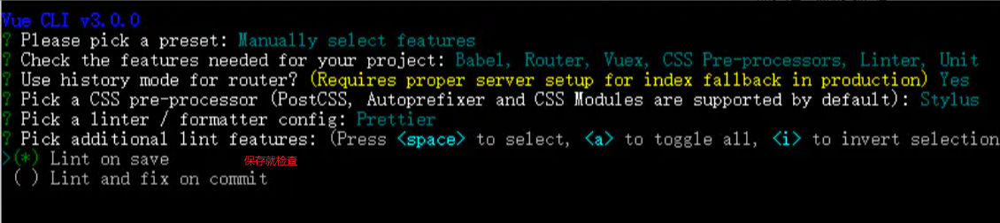
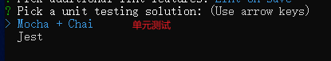
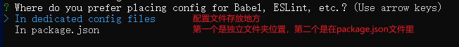
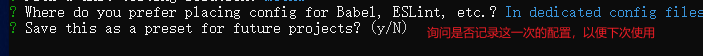

#### webpack方式

> vue init webpack 项目名



> webpack 启动项目方式

```bash
npm run dev
```

#### vue create xxx方式**（推荐）**

> vue create 项目名



**一般选择手动（Manually）**



**注意，空格键是选中与取消，A键是全选**














**一般是独立文件夹位置**



> 启动方式

```bash
vue run serve
```

**语法检查可以不开！！！！真的很碍事**

#### Vite方式

> 第三种方式就使用vite

