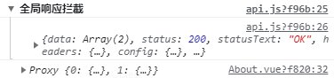

> 封装axios为了让代码冗余减少，而且使用更加简单

在src下新建文件夹http 文件夹下新建文件api.js


> 使用封装的axios

```javascript
import { get } from "../http/api" //导入
```


#### 添加baseURL

> 添加baseURL就可以集体控制所有使用了封装axios访问url


> 使用


#### baseURL判断生产环境

```vue
baseURL:process.env.NOOE.ENV === 'development'?'域名':'/'
```

> 这样可以自动判断使用开发环境的url还是生产环境的

#### 拦截器

> 指的是所有请求或者响应都先走拦截器内的内容，然后再执行请求或响应

##### 请求拦截

> 所有请求都想走请求的拦截


##### 响应拦截

> 所有响应都想走响应的拦截




#### 发送代token的请求

> 有时候请求数据需要向后端发送请求头携带token或者其他的场景，请求拦截就可以完成


#### 封装代理

> 解决cors问题


api.js


> 使用


