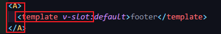

#### 使用slot

```vue
<template>
  <div class="home">
    <A>a</A> //a将被加载到A组件中的插槽显示
  </div>
</template>

<script>
import A from "@/components/A.vue";
export default {
  name: "Home",
  components: {
    A,
  },
};
</script>
```

```vue
<template>
  <div>
    <slot></slot> 子组件有这个标签父组件的内容才能被加载过来
  </div>
</template>
<script>
export default {
  name: "A",
};
</script>
```

#### 备用内容

```vue
<template>
  <div class="home">
    <A>a</A> //这里传递了a这个数据到子组件的插槽所以显示a，如果没有传递数据那么就显示子组件slot内的内容
  </div>
</template>

<script>
import A from "@/components/A.vue";
export default {
  name: "Home",
  components: {
    A,
  },
};
</script>
```

```vue
<template>
  <div>
    <slot>b</slot> //如果父组件没有传递内容那就显示b
  </div>
</template>
<script>
export default {
  name: "A",
};
</script>
```

#### 具名插槽

> 在遇到需要多个插槽的时候 `<slot>` 元素有一个特殊的 attribute：`name`。这个 attribute 可以用来定义额外的插槽  
>
> 使用多个插槽是需要定义插槽名 <slot name="xxx"><slot>
>
> 然后调用模板<template v-slot="xxx"></template>

```vue
<template>
  <div>
    <header>
      <slot name="header"></slot>
    </header>
    <main>
      <slot name="main"></slot>
    </main>
    <footer>
      <slot></slot> //默认name是default
    </footer>
  </div>
</template>
<script>
export default {
  name: "A",
};
</script>
```

> 一个不带 `name` 的 `<slot>` 出口**会带有隐含的名字“default”。**

```vue
<template>
  <div class="home">
    <A>
      <template v-slot:header>header</template>
    </A>
    <A>
      <template v-slot:main>main</template>
    </A>
    <A>
      <template v-slot:default>footer</template> //这里用的名字就是default默认名字
    </A>
  </div>
</template>

<script>
import A from "@/components/A.vue";
export default {
  name: "Home",
  components: {
    A,
  },
};
</script>

```

> 重点



> 组件包含tmeplate 然后templates v-slot
>
> **`v-slot` 只能添加在 `<template>` 上**

#### **动态插槽名**

> [**动态指令参数**](https://v3.cn.vuejs.org/guide/template-syntax.html#动态参数)也可以用在 `v-slot` 上，来定义动态的插槽名：

```vue
<base-layout>
  <template v-slot:[dynamicSlotName]> //插槽名可以动态绑定
    ...
  </template>
</base-layout>
```

#### 具名插槽的**缩写**

> 跟 `v-on` 和 `v-bind` 一样，`v-slot` 也有缩写，即把参数之前的所有内容 (`v-slot:`) 替换为字符 `#`。例如 `v-slot:header` 可以被重写为 `#header`：

```vue
<template>
  <div class="home">
    <A>
      <template #header>header</template> //这里的#就代表了v-slot:
    </A>
    <A>
      <template #main>main</template> //这里的#就代表了v-slot:
    </A>
    <A>
      <template #default>footer</template> //这里的#就代表了v-slot:
    </A>
  </div>
</template>
```

