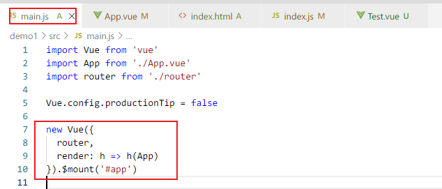
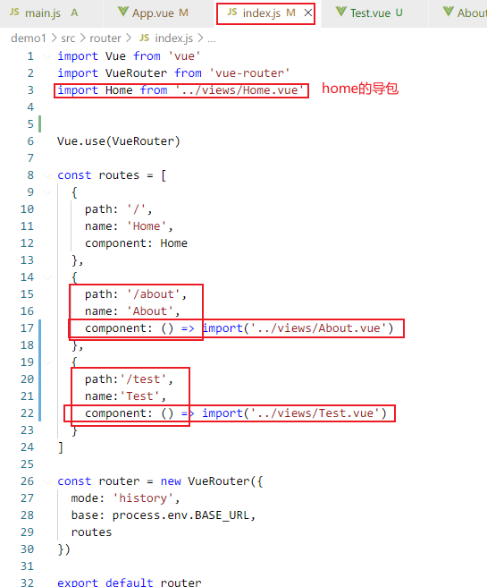
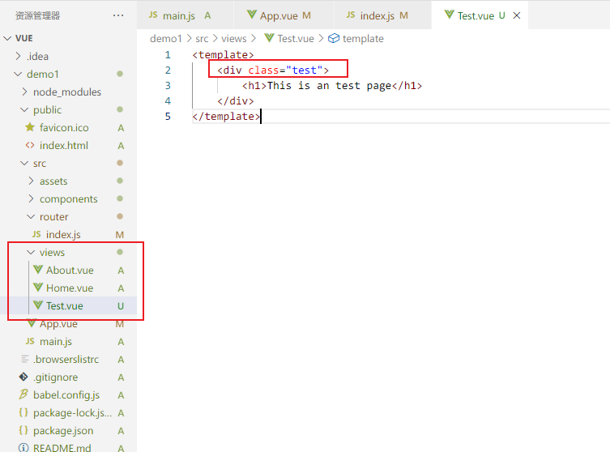
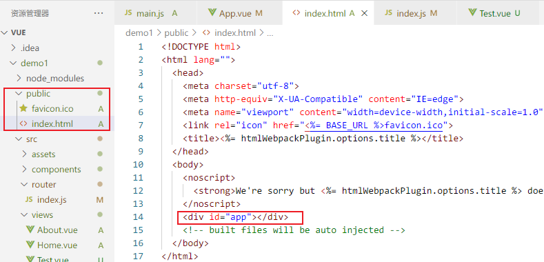

> main.js

main.js文件不需要改，是入口文件

new Vue中的就是挂载的app已经注册router配置

> **router目录下的index.js**

* path:添加路径
* name:配置路径名
* component:导包
* export default router:**导出**路由配置

> 组件

views目录下的都是自定义的页面

在views下新建组件Test.vue

`<template>`包裹的相当于就是html代码

`<script>`包裹的就是js代码

`<style>`包裹的就是css代码

`
`这是和router目录下的index.js中的注册路由进行绑定

> 主页面

![image-20210725101553326](Vue 起步.assets/image-20210725101553326.png

在public下的index.html文件就是展示主页面的文件

`

`节点，受挂载

