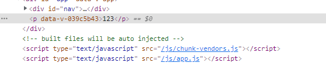
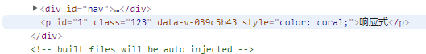

#### **前言**

> Vue3更新:
>
> * h**需要从全局导入进来**(不再是render函数的**参数**了)
> * render函数的参数改变了(为了在常规组件和函数组件中表现一致)
> * VNodes具备了**扁平的属性结构**

#### Composition API render

> 渲染文本

```vue
<script>
import { ref } from "@vue/reactivity"
import { h } from 'vue'
import { onMounted } from "@vue/runtime-core";
export default {
  setup() {
    return () => h ('p',{
      innerHTML:'123'
    })
  }
}
</script>
```



> 实现响应式

```vue
<script>
import { ref } from "@vue/reactivity"
import { h } from 'vue'
import { onMounted } from "@vue/runtime-core";
export default {
  setup() {
    const RefDate = ref('响应式')
    return () => h ('p',{
      innerHTML:RefDate.value
    })
  }
}
</script>
```

> 绑定css

```vue
<script>
import { ref } from "@vue/reactivity"
import { h } from 'vue'
import { onMounted } from "@vue/runtime-core";
export default {
  setup() {
    const RefDate = ref('响应式')
    // 绑定响应式颜色
    const elColor = ref('coral')
    return () => h ('p',{
      innerHTML:RefDate.value,
      style:{
        color:elColor.value
      }
    })
  }
}
</script>
```

> 绑定id及class 和`v-bind:style`一样的 API

```vue
<script>
import { ref } from "@vue/reactivity"
import { h } from 'vue'
import { onMounted } from "@vue/runtime-core";
export default {
  setup() {
    const RefDate = ref('响应式')
    // 绑定响应式颜色
    const elColor = ref('coral')
    return () => h ('p',{
      innerHTML:RefDate.value,
      style:{
        color:elColor.value
      },
      id:1,
      class:'123',
    })
  }
}
</script>
```



> 和`v-bind:class`一样的 API

```js
setup() {
    const RefDate = ref('响应式')
    // 绑定响应式颜色
    const elColor = ref('coral')
    return () => h ('p',{
      innerHTML:RefDate.value,
      style:{
        color:elColor.value,
        fontSize:'12px',
      },
      id:'1',
      class:'123',
      // 这里绑定class会覆盖掉上面的class
      'class':{
        foo:true,
        baz:true
      },
    })
  }
```

> 绑定事件

```vue
<script>
import { ref } from "@vue/reactivity"
import { h } from 'vue'
export default {
  setup() {
    const RefDate = ref('响应式')
    // 绑定响应式颜色
    const elColor = ref('coral')
    // 定义函数
    const clickdiy = () => {
      console.log('click')
    }
    return () => h ('p',{
      innerHTML:RefDate.value,
      style:{
        color:elColor.value,
        fontSize:'12px',
      },
      id:'1',
      class:'123',
      // 这里绑定class会覆盖掉上面的class
      'class':{
        foo:true,
        baz:true
      },
      // 绑定事件
      onClick: clickdiy,
      // 绑定多个事件
      // onClick: [clickdiy,clickdiy2]
    })
  }
}
</script>
```

