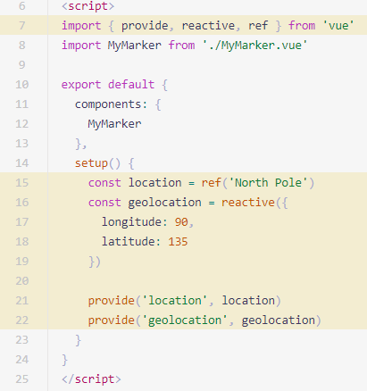

#### 介绍

> 因为在每个组件的script内东西太多，到了以后会导致东西非常多所以有了组合API的出现来解决这个现象
>
> **setup 作为组合式 API 的入口点，也就是说，组合式 API 都必须只能在 setup 中使用**

#### setup

```vue
<template>
  <div>{{ this.age }}</div>  这里直接使用setup内定义的数据
</template>
<script>
export default {
  name: "A",
  //created实例被完全初始化之前，所以this无法指向它因为没有初始化结束
  setup(props, context) {
    return {
      age: 1,
    };
  },
};
</script>
```

> 函数也可以放在setup内

> **setup是在created实例被完全初始化之前，所以this无法指向它因为没有初始化结束**,**但是定义methods内的函数是可以this访问到setup内的**

```vue
<template>
	这里可以直接使用
  <div @click="ejectclick">{{ this.age }}</div>
</template>
<script>
export default {
  name: "A",
  setup(props, context) {
    return {
      age: 1,
        //
      ejectclick: () => {
        alert(666);
          //
      },
    };
  },
};
</script>
```

#### **ref reactive 响应式的引用**

> 在setup内数据加载完成之后，如果发现数据被改动然后自动响应就需要ref reactive
>
> **原理 通过proxy对象数据信息封装 当数据变化时，触发模板等内容的更新**

> **ref 单值数据响应式**
>
> 接收一个普通对象然后返回该普通对象的响应式代理。
>
> **使用之前需要 import { ref } from "vue"; //封装ref**

```vue
<template>
  <div>{{ age }}</div>
</template>
<script>
import { ref } from "vue"; //封装ref
export default {
  name: "A",
  setup(props, context) {
    let age = ref("2");
    setTimeout(() => {
      age.value = "5"; //这里改值不写是xxx.value的方式
    }, 2000); //2秒之后响应式的改变age的值，
    return { age };
  },
};
</script>
```

> **reactive  对象数据响应式**
>
> 接受一个参数值并返回一个响应式且可改变的 ref 对象。
>
> **使用之前 import { reactive } from "vue";**

```vue
<template>
  <div>{{ age.msg }}</div>
</template>
<script>
import { reactive } from "vue";
export default {
  name: "A",
  setup(props, context) {
    let age = reactive({ msg: "a" }); //代理对象
    setTimeout(() => {
      age.msg = "b"; //改变对象值
    }, 2000);
    return { age };
  },
};
</script>
```

#### computed - 计算属性

> 只传 getter
> 返回一个**默认不可手动修改的 ref 对象。**

```vue
<template>
  <div>{{ words }}</div>
</template>
<script>
import { reactive, computed } from "vue";
export default {
  name: "A",
  setup(props, context) {
    let letter = reactive({ msg: "a", tip: "b" });
    let words = computed(() => letter.msg + letter.tip);
    words.value = "1"; // 报警告，computed value is readonly
    return { words };
  },
};
</script>
```

> 同时传 getter、setter
> **创建一个可手动修改的计算状态。**

```vue
<template>
  <div>
    <h1>computed - 计算属性</h1>
    <p>firstname: <input v-model="user.firstname" /></p>
    <p>lastname: <input v-model="user.lastname" /></p>
    <p>username: <input v-model="username" /></p>
  </div>
</template>

<script>
import { reactive, computed } from "vue";
export default {
  name: "Computed2",
  setup() {
    const user = reactive({ firstname: "Chen", lastname: "Haihong" });
    const username = computed({
      get: () => user.firstname + " " + user.lastname,
      set: (value) => {
        const [firstname, lastname] = value.trim().split(" ");
        user.firstname = firstname;
        user.lastname = lastname;
      },
    });
    return { user, username };
  },
};
</script>
```

#### watchEffect、watch - 侦听器

> watchEffect
>
> 立即执行传入的一个函数，并响应式追踪其依赖，并在其依赖变更时重新运行该函数
>
> 1. **立即执行，没有惰性，页面的首次加载就会执行**
> 2. **自动检测内部代码，代码中有依赖 便会执行**
> 3. **不需要传递要侦听的内容 会自动感知代码依赖，不需要传递很多参数，只要传递一个回调函数**
> 4. **不能获取之前数据的值 只能获取当前值**
> 5. **一些=异步的操作放在这里会更加合适**

```vue
<template>
  <div>{{ data.count }}</div>
</template>
<script>
import { reactive, watchEffect } from "vue";
export default {
  name: "A",
  setup(props, context) {
    let data = reactive({ count: 1 });
      //
    watchEffect(() => console.log(`侦听:${data.count}`));
    setInterval(() => {
      data.count++;
    }, 2000);
    return { data };
  },
};
</script>
```

> watch
> 对比watchEffect，watch允许我们：
>
> * 懒执行副作用，也就是说仅在侦听的源变更时才执行回调；**第一次页面展示的时候不会执行，只有数据变化的时候才会执行**
> * 更明确哪些状态的改变会触发侦听器重新运行副作用;
> * **访问侦听状态变化前后的值,参数可以拿到当前值和原始值**
>
> * 可以侦听**多个数据的变化**，用一个侦听起承载

```vue
<template>
  <div>{{ data.count }}</div>
  <div>{{ data.count2 }}</div>
  <button @click="stopAll">stop</button>
</template>
<script>
import { reactive, watch } from "vue";
export default {
  name: "A",
  setup(props, context) {
    let data = reactive({ count: 1, count2: 1 });
    // 侦听单个数据源
    const stop1 = watch(data, () => {
      console.log("watch", data.count, data.count2);
    });
    // 侦听多个数据源
    const stop2 = watch([data], () => {
      console.log("watch2", data.count, data.count2);
    });
    setInterval(() => {
      data.count++;
    }, 2000);
    return {
      data,
      stopAll: () => {
        stop1();
        stop2();
      },
    };
  },
};
</script>
```

#### readonly - “深层”的只读代理

> 传入一个对象（响应式或普通）或 ref，**返回一个原始对象的只读代理**。一个只读的代理是“**深层的**”，**对象内部任何嵌套的属性也都是只读的**。

```vue
<template>
  <div>{{ data.count }}</div>
  <div>{{ copy.count }}</div>
</template>
<script>
import { reactive, readonly, watch } from "vue";
export default {
  name: "A",
  setup(props, context) {
    let data = reactive({ count: 0 });
    let copy = readonly(data); //定义为readonly 引用data的数据
    setInterval(() => {
      data.count++;
      copy.count++; // 报警告，Set operation on key "count" failed: target is readonly. Proxy {count: 1}
    }, 2000);
    return {
      data,
      copy,
    };
  },
};
</script>
```

#### toRef - 为 reactive 对象的属性创建一个 ref

> toRef 可以用来**为一个 reactive 对象的属性创建一个 ref**。这个 ref 可以**被传递并且能够保持响应性**。
>
> toRef：是引用，修改响应式数据**会**影响以前的数据,数据发生变化，界面就**不会更新**
>
> 应用场景
>
> - 如果想让响应式数据和以前的**数据关联起来**，并且更新响应式数据之后**还不想更新UI**，那么就可以使用toRef

```vue
<script>
import { reactive, toRef } from "vue";
export default {
  name: "A",
  setup(props, context) {
    let data = reactive({ age: 1 });
    let age = toRef(data, "age"); //创建
    age.value++
    console.log(data.age); //输出2
    data.age++;
    console.log(age.value);//输出3
  },
};
</script>
```

#### toRefs - 解构响应式对象数据

> 把一个**响应式对象转换成普通对象**，该普通对象的**每个 property 都是一个 ref ，和响应式对象 property 一一对应**。

```vue
<template>
  <div>{{ age }}</div>
  <div>{{ count }}</div>
</template>
<script>
import { reactive, toRefs } from "vue";
export default {
  name: "A",
  setup(props, context) {
    let data = reactive({
      age: 1,
      count: 10,
    });
    return { ...toRefs(data) }; //转换为普通对象
  },
};
</script>
```

#### isRef、isProxy、isReactive、isReadonly

> 检查一个值/对象是否为一个 ref / proxy / reactive / readonly 对象。

#### 在 `setup` 内注册生命周期钩子

> 为了使组合式 API 的功能和选项式 API 一样完整，我们还需要一种在 `setup` 中注册生命周期钩子的方法。这要归功于 Vue 导出的几个新函数。组合式 API 上的生命周期钩子与选项式 API 的名称相同，**但前缀为 `on`：即 `mounted` 看起来会像 `onMounted`**

```javascript
import { ref, onMounted } from 'vue' //需要被导入

// 在我们的组件中
setup (props) {
  const repositories = ref([])
  const getUserRepositories = async () => {
    repositories.value = await fetchUserRepositories(props.user)
  }

  onMounted(getUserRepositories) // 在 `mounted` 时调用 `getUserRepositories`

  return {
    repositories,
    getUserRepositories
  }
}
```

#### **切记！！！**

> setup默认有两个参数props和context 
>
> computed,ref reactive,watchEffect watch,readonly...都需要导入
>
> import {xxx} from 'vue';

#### 在setup中使用Provide/inject

> provide/inject只能用去**非兄弟**组件通信

##### Provide

> 在 `setup()` 中使用 `provide` 时，我们首先从 `vue` 显式导入 `provide` 方法。这使我们能够调用 `provide` 来定义每个 property

> `provide` 函数允许你通过两个参数定义 property：
>
> 1. **name (`<String>` 类型)**
> 2. **value**

```vue
<script>
import { provide } from 'vue' //导入Provide

export default {
  components: {
    MyMarker
  },
  setup() {
      //传递的数据需要定义为name，vale
    provide('location', 'North Pole')
    provide('geolocation', {
      longitude: 90,
      latitude: 135
    })
  }
}
</script>
```

##### 使用 inject

> 在 `setup()` 中使用 `inject` 时，也需要从 `vue` 显式导入

> `inject` 函数有两个参数
>
> 1. **要 inject 的 property 的 name**
> 2. 默认值 (**可选**)

```vue
<script>
import { inject } from 'vue' //导入inject

export default {
  setup() {
      //定义暴露
    const userLocation = inject('location', 'The Universe')
    const userGeolocation = inject('geolocation')
	//返回使用
    return {
      userLocation,
      userGeolocation
    }
  }
}
</script>
```

##### 添加响应性

> 为了增加 provide 值和 inject 值之间的响应性，我们可以在 **provide 值时使用 ref 或 reactive**



> 现在，如果这两个 property 中有任何更改，**相对应的组件也将自动更新**

##### 修改响应式 property

> 当使用响应式 provide / inject 值时，**建议尽可能将对响应式 property 的所有修改限制在\*定义 provide 的组件\*内部**

```javascript
setup(props, context) {
    let count = reactive({
      age: "1",
    });
    //在provide中定义修改property的方法
    const update = () => {
      count.age = "666";
    };
    provide("count", readonly(count)); //在这里设置readonly，数据就不会被jinject的组件更改
    provide("update", update); //传递函数
  },
```

```vue
<template>
  <div>
    {{ count.age }}
    <button @click="update">clkick</button> //使用方法
  </div>
</template>
<script>
import { inject } from "vue";
export default {
  name: "A",
  setup(props, context) {
    let count = inject("count");
    const update = inject("update"); //接收方法
    return {
      count,
      update,//返回
    };
  },
};
</script>
```

#### **重点**

> **在setup中的数据和方法还有其他需要返回的必须return暴露出去，模板才能使用**

> 踩坑：return必须放在最后

#### 单位件setup新写法

> `script setup`这种写法**不用最后写return，在外界也可以直接使用**

```vue
<script setup>
import { ref } from "@vue/reactivity";

const msg2 = ref("test");
console.log(props);
</script>
```

> `script setup`这种写法不用需要显示的导入components组件就可以直接使用组件

```vue
<template>
  <div>
    <Child1></Child1>
  </div>
</template>
<script setup>
import Child1 from "@/components/Child1.vue";
import { ref } from "vue";
    //这里不再需要写components:{组件名}就可以直接使用组件
</script>

<style lang="scss" scoped></style>

```

