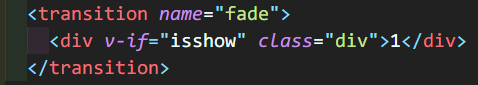
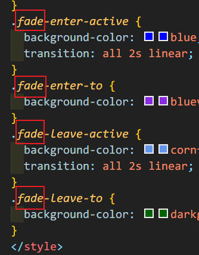
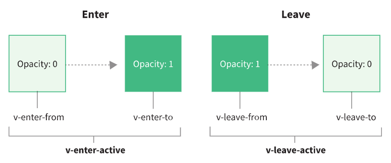

> Vue 提供了一些抽象概念，可以帮助处理过渡和动画，特别是在响应某些变化时。这些抽象的概念包括：

#### 进入过渡 & 离开过渡

> 在插入、更新或从 DOM 中移除项时，Vue 提供了多种应用转换效果的方法。这包括以下工具
>
> * 自动为 CSS 转换和动画应用 class；
> * 集成第三方 CSS 动画库，例如 [animate.css](https://animate.style/) ；
> * 在过渡钩子期间使用 JavaScript 直接操作 DOM；
> * 集成第三方 JavaScript 动画库。

> Vue 提供了 `transition` 的封装组件，在下列情形中，可以给任何元素和组件**添加进入/离开过渡**

```vue
<template>
  <div>
    <button @click="change">click</button>  //绑定方法改变isshow的值
    <transition name="fade"> //添加name后面的style样式会用到
      <div v-if="isshow" class="div">1</div> //判断isshow已否显示
    </transition>
  </div>
</template>
<script>
import { ref } from "vue"; //导入ref因为需要使用ref来响应数据
export default {
  name: "Transition1",
  setup(props, context) {
    let isshow = ref(true); //定义isshow并且ref它成为一个响应数据
     //改变isshow值得方法
      const change = () => {
      isshow.value = !isshow.value;//这里必须要是取value值
    };
      //暴露数据，模板才可以使用
    return {
      isshow,
      change,
    };
  },
};
</script>

<style scoped>
//初始样式
.div {
  background-color: red;
  height: 100px;
  width: 100px;
}
//进入中途
.fade-enter-active {
  background-color: blue;
  transition: all 2s linear;//这里必须要指定时间
}
//到达
.fade-enter-to {
  background-color: blueviolet;
}
//离开中途
.fade-leave-active {
  background-color: cornflowerblue;
  transition: all 2s linear; //这里必须要指定时间
}
//离开完毕
.fade-leave-to {
  background-color: darkgreen;
}
</style>

```

> 在我们需要加动画的模板出必须使用`transition`内置组件包裹住



> `transition`上的name和下面他的样式相对应



> **离开中途和进入中途必须指定时间**

```css
 transition: all 2s linear;
```

#### **动画流程图**



