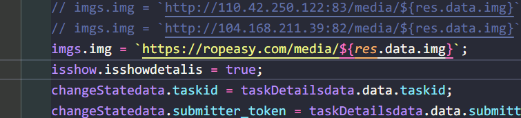
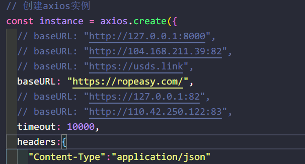

> 首先nginx(在此之前需要先去cloudflare进行https)

```bash
server {        
		listen       80;#需要使用的端口号   
		server_name  ropeasy.com;      #域名  
		location / {      
		  # autoindex on;
			root   /www/server/nginx/html/dist; #dist路径           
		 	index  index.html index.htm;
		 	try_files $uri $uri/ /index.html;
		 	# proxy_pass http://104.168.211.39:80;
		  }
		  # 请求转发给后端
		  location ^~ /api {
                proxy_pass http://127.0.0.1:8000/api;
              }
          	# 请求转发图片
              location ^~ /media { #匹配url里面的media
                 root /www/wwwroot/104.168.211.39/book_shop;
                 # 后端图片存放地址
              }
}
```

> 更改项目中的url



> http/api.js



