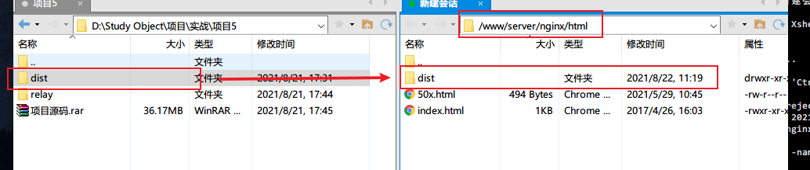
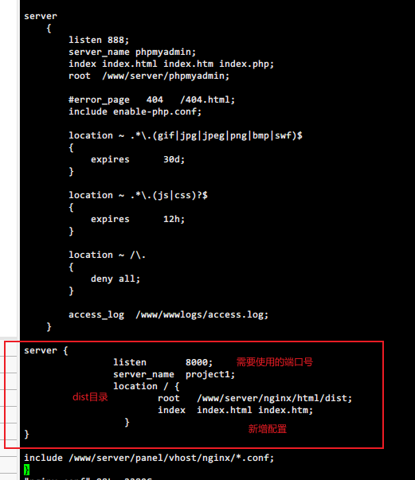

> 先要安装nginx

> 找到nginx目录


> 在nginx/html上传文件



> cd到nginx的conf目录下执行


关闭nginx

> 修改conf目录下的nginx.conf文件




```bash
server {        
		listen       8080;#需要使用的端口号   
		server_name  project1;        
		location / {            
			root   /edu/dist; #dist路径           
		 	index  index.html index.htm;
             try_files $uri $uri/ /index.html; #解决页面刷新403问题
		  }    
}

```

退出

> 重新加载配置文件


> 启动nginx


