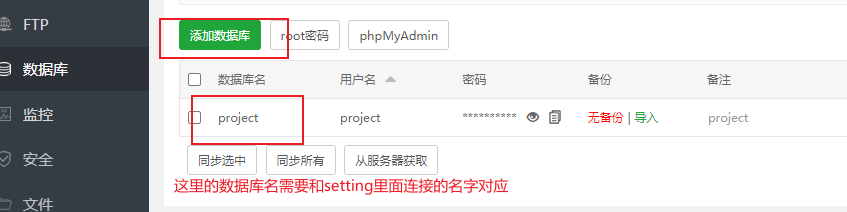

> 更改本机上的项目文件

> 在本地终端执行pip freeze > requirements.txt
>
> 生成requirements.txt文件

> 然后打包

> 在宝塔面板安装mysql
>
> 和python管理器 
>
> 还有 Nginx 1.20.1

> 在宝塔面板新建网站

> 新建网站之后会在文件目录新建一个与网站同名的目录

> 然后上传压缩好的项目文件

> 然后再宝塔面板python管理器里面添加项目

> 因为项目连接了mysql的所以需要更改项目配置

> 宝塔面板新建数据库

> 新建好的数据需要设置所有人访问

> 然后进入虚拟环境(宝塔面板在python项目管理创建django项目后会自动在项目目录下生成一个venv虚拟环境，直接cd进去使用)

> 最开始的时候是需要执行makegirations 和migrate的

> 如果runserver失败查看是否缺少依赖，如果缺少依赖就在宝塔面板安装依赖(如果需要任何ip访问，runserver的时候后面需要带 0.0.0.0:端口号)

