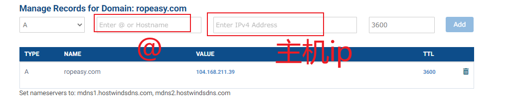

> 1 服务器&域名

> 2 下载好软件(nginx/mysql..)

> 在去域名解析之前需要做一件事
>
> 在dns管理里面条件一条记录



> 3 域名解析
>
> 这里推荐cloudflare
>
> 填写自己的链接进去,然后验证服务器就行,把服务器自带的名字删了使用cloudflare的名字
>
> 最后等待解析完成

> 4 配置nginx

```bash
server {        
		listen       80;#需要使用的端口号   
		server_name  usds.link;#域名        
		location / {      
		  # autoindex on;
			root   /www/server/nginx/html/dist; #dist路径           
		 	index  index.html index.htm;
		 	try_files $uri $uri/ /index.html;
		 	# proxy_pass http://104.168.211.39:80; #请求转发
		  }
		  # 请求转发给后端
		  #匹配请求的url是否包含api关键,包含就走下面这个链接 转发给后端
		  location ^~ /api {
                proxy_pass http://127.0.0.1:8000/api; #这里是后端api
           }
           # 请求转发图片
           location ^~ /media { #匹配url里面的media
           		root /www/wwwroot/104.168.211.39/book_shop;
           		# 后端图片存放地址
           }
}
```

> 5 创建网站(后端)
>
> python包管理器....
>
> 在最后启动django服务的时候
>
> `python manage.py runserver`就可以了

> 6 在vue项目内的http/api.js文件的baseURL也需要和域名对应
>
> 例如:`baseURL: "https://usds.link"`
>
> 如果这里不配置这个会导致控制台报错 Mix..什么的错误

> 最后就可以通过https访问了
