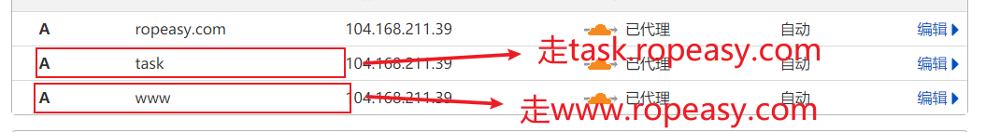
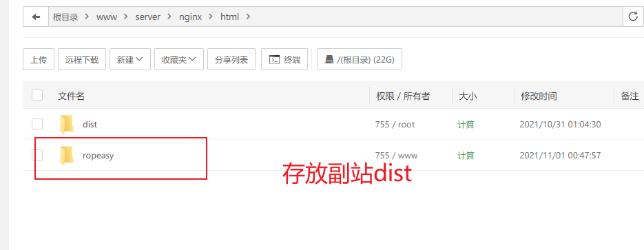

> 1.先去cloudflare添加记录



> 上传文件



> nginx **添加**

```bash
server {        
		listen       80;# 这里还是监听80  
		server_name  task.ropeasy.com; #只不过这里换成二级域名  
		location / {
		  # autoindex on;
			root   /www/server/nginx/html/ropeasy/dist; #dist路径           				#副站dist路径
		 	index  index.html index.htm;
		 	try_files $uri $uri/ /index.html;
		  }
}
```

